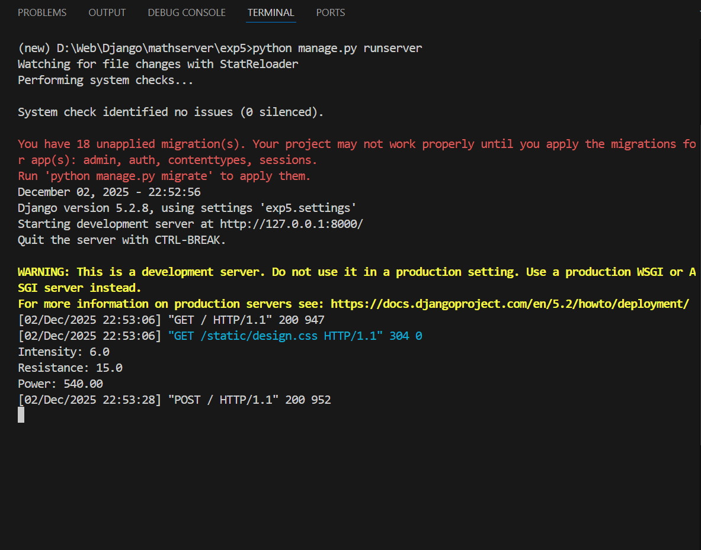
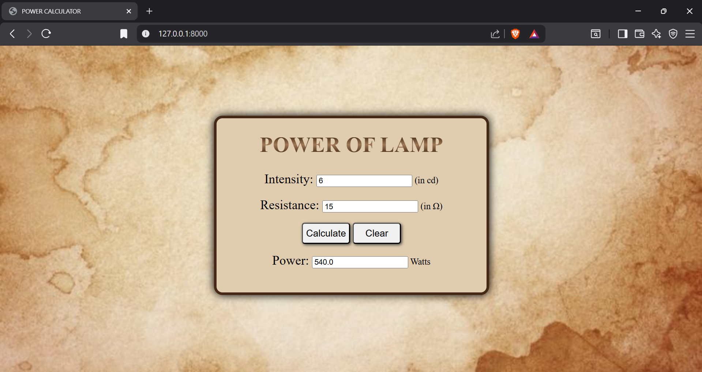

# Ex.05 Design a Website for Server Side Processing
# Date: 02.12.2025
# AIM:
To design a website to calculate the power of a lamp filament in an incandescent bulb in the server side.

# FORMULA:
P = I2R
P --> Power (in watts)
I --> Intensity
R --> Resistance

# DESIGN STEPS:
## Step 1:
Clone the repository from GitHub.

## Step 2:
Create Django Admin project.

## Step 3:
Create a New App under the Django Admin project.

## Step 4:
Create python programs for views and urls to perform server side processing.

## Step 5:
Create a HTML file to implement form based input and output.

## Step 6:
Publish the website in the given URL.

# PROGRAM :
urls.py
```
from django.contrib import admin
from django.urls import path
from powerapp import views

urlpatterns = [
    path('admin/', admin.site.urls),
    path('', views.power)
]
```
views.py
```
from django.shortcuts import render
def power(request):
    pwr = ''
    if request.method == "POST":
        intensity=float(request.POST.get("int"))
        resistance=float(request.POST.get("res"))
        pwr=(intensity**2)*resistance
        print(f"Intensity: {intensity}\nResistance: {resistance}\nPower: {pwr:.2f}")
    return render(request,'calcpower.html',{'Power':pwr})
```
design.css
```
body{
    background-size: cover; 
    background-position: center;
    margin-top:10%;
    text-align: center;
}
.box{
    margin-left: auto;
    margin-right: auto;
    width: 480px;
    height: 310px;
    background-color:#e0ccaf;
    border: 5px solid #452816;
    border-radius: 15px;
    box-shadow: black 0px 0px 15px;
}
button{
    height: 12%; 
    width: 18%; 
    font-size: 17px;
    border-radius: 5px;
    box-shadow: rgb(71, 71, 71) 2px 2px 5px;
}
h1{
    background:linear-gradient(180deg,rgb(33, 16, 0),#a07856,rgb(33, 16, 0));
    background-clip:text;
    color:transparent;
    font-size: 38px;
}
p{
    font-size: 30px;
}
label{
    font-size: 23px;
}
```
calcpower.html
```

<html lang="en">
    <head>
        <title>POWER CALCULATOR</title>
        <link rel="stylesheet" href="">
        <style>
            body{
                background-image: url("");
            }
        </style>
    </head>
    <body>
        <div class="box">
        <h1>POWER OF LAMP</h1>
        <form method="POST">
            
            <label>Intensity: </label>
            <input type="text" name="int" required>   (in cd)<br><br>

            <label>Resistance: </label>
            <input type="text" name="res" required>   (in Ω)<br><br>

            <button type="submit">Calculate</button>   <button type="reset">Clear</button>
        </form>
        <label>Power: </label>
        <input type="text" value="{{Power}}">   Watts
        </div>
    </body>
</html>
```
# SERVER SIDE PROCESSING:

# HOMEPAGE:

# RESULT:
The program for performing server side processing is completed successfully.
